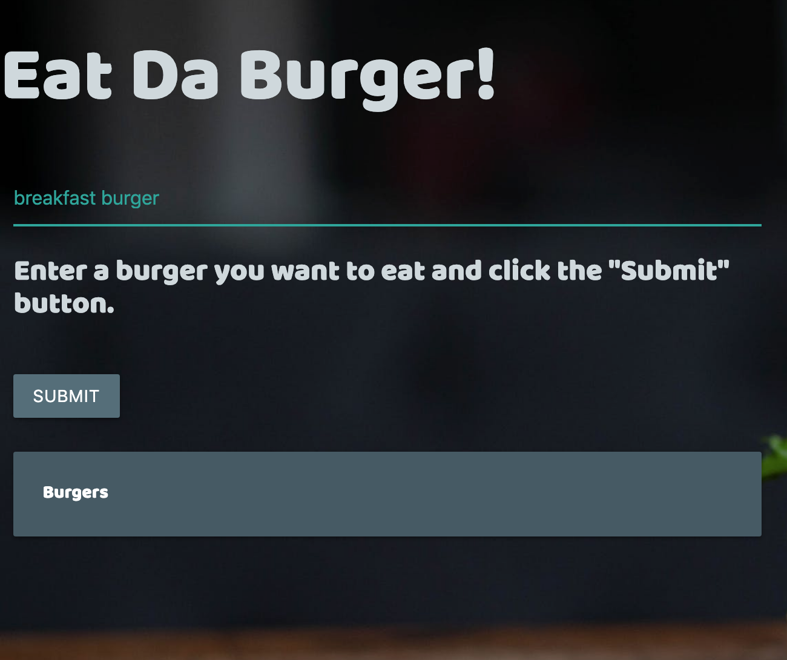
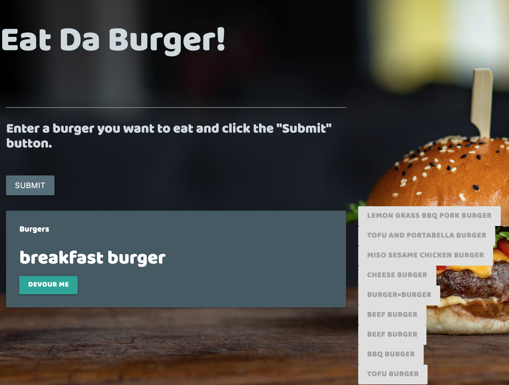
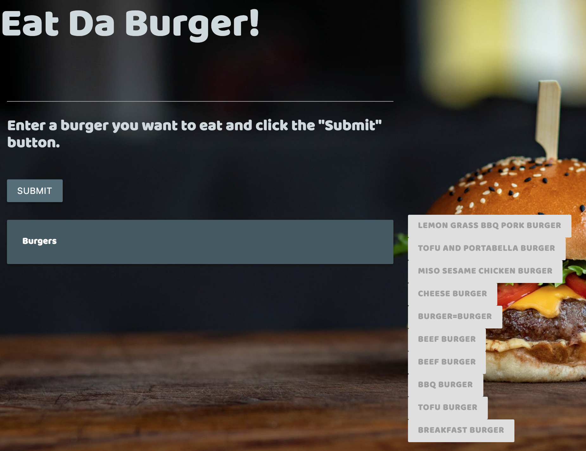

# burger

## Overview

This is a burger logger with **MySQL**, **Node**, **Express**, **Handlebars** and a homemade **ORM**(!). 

It is my **Node Express Handlebars** Assignment in Gatech Coding bootcamp. I followed the MVC design pattern offered by Coding Bootcamp, and designed the wedpage on my own.

## About "Eat-Da-burger!"

* According to homework instructions, Eat-Da-Burger! is a "restaurant app that lets users input the names of burgers they'd like to eat".

* Whenever a user submits a burger's name, the app will display the name on the left side of the page, with a `Devour it!` button.

* When the user clicks `Devour it!`, the burger will move to the right side of the page.

* The app will store every burger in a database.

For example, I entered a "breakfast burger" and click the "submit" button...

when the `Devour it!` was clicked, "breakfast burger" became an disabled button, and went to the right side of the page.
 

### The demo of my `Eat-Da-Burger` application can be found [here](https://eat-da-burger-0605.herokuapp.com/).

## Installation

To run the application locally, first clone this repository with the following command.

     git clone git@github.com:mayahuang2018/burger.git
    
Next, install the application dependencies.

    cd burger
    npm install

Finally, run the node server locally.

    node server.js

Then, you can open the local application on port 8080 at the URL: http://localhost:8080/

